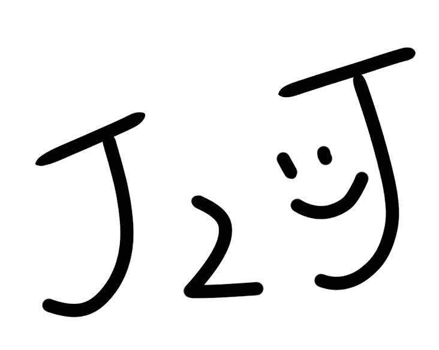
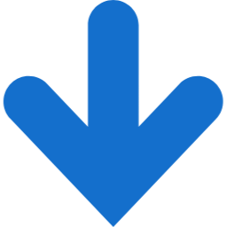

# J2J
# 某君とそのた開発者の皆さんへ

## demo.htmlについて
これはメインになるページのHTMLです。
いわゆるホームってやつです。
検索画面が出てきます。なにかしら入力してEnterキーを押すor簡単にするボタンを押すとdemo2 . htmlに移るようになっています

## demo2.htmlについて
これは検索結果を表示するHTMLです。
難しい日本語→簡単になった日本語　と、類義語候補を5つ載せられる枠があります。
文章の翻訳になると、cssがはみ出る可能性が少々あるので、このHTMLはまた変えるかもしれません

## ロゴ.jpgについて
いっちばん上の小さくのっているロゴの画像です

## ya.pngについて
矢印の画像です。
検索結果にあるあの青い矢印です。

## demo.css について
このホームページたちのスタイルをつくるものです。